# 📚 BookVerse — Online Bookstore

A modern frontend-based online bookstore built with **React** and **Vite**.

BookVerse provides a complete bookstore experience where users can browse books, search and filter the catalog, explore categories, add books to a wishlist or shopping cart, complete a checkout flow, and manage their profile.

The project also includes a separate **Admin Dashboard** for managing books, categories, users, and orders.

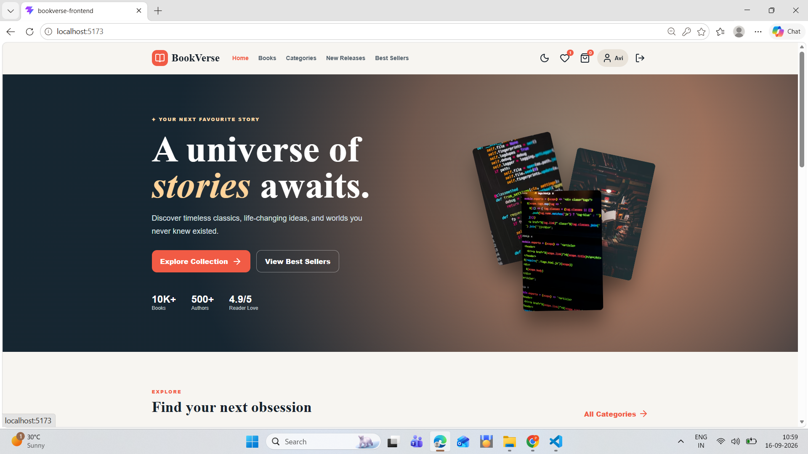

---

## 📌 Project Overview

BookVerse is a React Single Page Application (SPA) designed to demonstrate a complete e-commerce frontend workflow.

The application has two main sections:

### 👤 Customer Side

Users can:

- Browse books
- Search for books
- Filter books by category
- Sort books
- Explore categories
- View New Releases
- View Best Sellers
- Add books to Wishlist
- Add books to Cart
- Update cart quantities
- Remove books from Cart
- Use Buy Now
- Register an account
- Login
- View their profile
- Complete checkout
- View payment/order success
- Switch between light and dark mode

### 🛠️ Admin Side

Administrators have access to a separate dashboard where they can manage:

- Books
- Categories
- Users
- Orders
- Admin profile
- Store statistics
- Quick-access management options

---

## ✨ Features

### 🏠 Home Page

The Home page is the main landing page of BookVerse.


It includes:

- BookVerse branding
- Navigation bar
- Hero section
- Featured books
- Navigation to the bookstore catalog
- Footer

The application uses reusable components such as:

```text
Navbar
BookCard
Footer
```

---

### 📚 Book Catalog

The Books page displays the complete bookstore catalog.

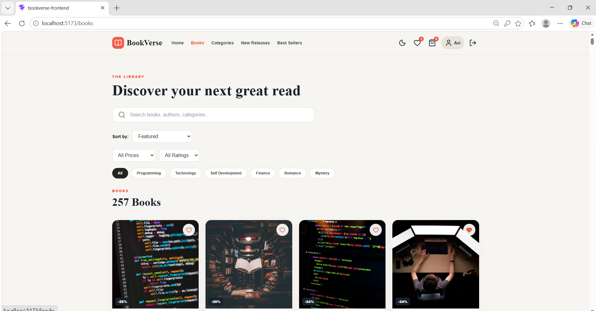

The current project contains:

- **257 books**
- **12 categories**

Each book contains information such as:

- Title
- Author
- Category
- Price
- Original price
- Rating
- Book cover
- Discount information

Books are displayed using the reusable `BookCard` component.

---

### 🔎 Search

Users can search the bookstore catalog.

Search functionality can be used to find books based on information such as:

- Book title
- Author
- Category

The search functionality is handled on the frontend using React state and filtering logic.

---

### 🔽 Filtering

The catalog supports filtering options such as:

**Category** — Users can browse books by category.

**Price** — Books can be filtered according to price ranges.

**Rating** — Users can filter books based on their rating.

---

### ↕️ Sorting

Books can be sorted using options such as:

- Featured
- Price — Low to High
- Price — High to Low
- Rating

The selected filtering and sorting values can also be represented through URL query parameters.

Example:

```text
/books?category=Programming
```

---

### 🏷️ Categories

BookVerse provides 12 book categories for easier discovery.

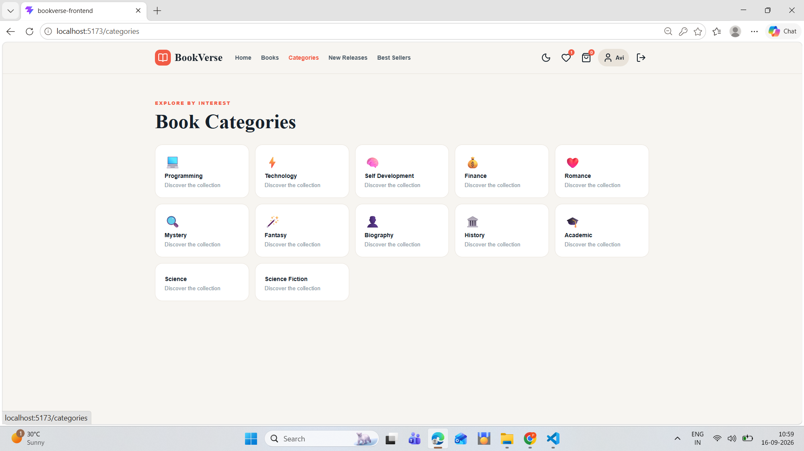

The categories cover areas such as:

- Programming
- Technology
- Self Development
- Finance
- Romance
- Mystery
- Fantasy
- Biography
- History
- Academic
- Science
- Science Fiction

Users can select a category and view the relevant books.

---

### 🆕 New Releases

The New Releases page provides a curated collection of recently added books.

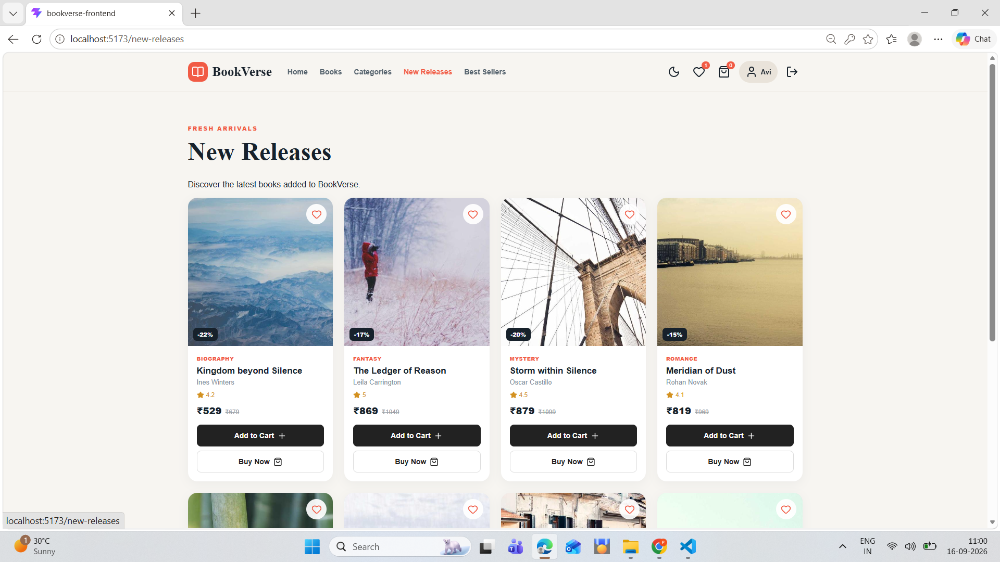

This gives users another way to discover books without searching the entire catalog.

---

### ⭐ Best Sellers

The Best Sellers page provides a curated collection of popular books.

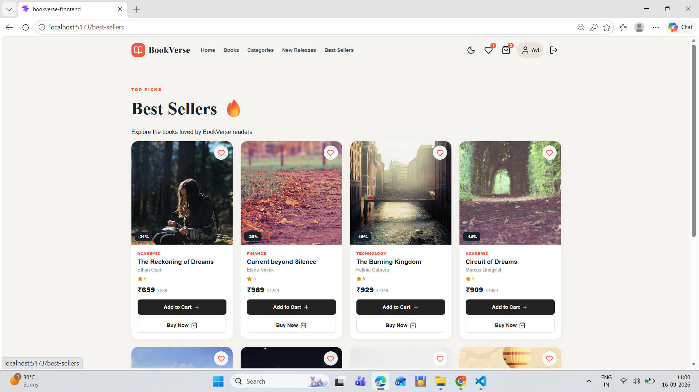

It provides another entry point into the catalog based on popularity.

---

### ❤️ Wishlist

Users can save books to their Wishlist.

When the heart button on a book is selected:

```text
Book not in wishlist
        ↓
Add to wishlist
```

If the book is already in the Wishlist:

```text
Book already in wishlist
        ↓
Remove from wishlist
```

Wishlist state is managed through the application's `AppContext`.

Wishlist information is persisted using browser `localStorage`.

---

### 🛒 Shopping Cart

The shopping cart allows users to manage books before checkout.

Users can:

- Add books
- Increase quantity
- Decrease quantity
- Remove books
- View subtotal
- View savings
- View shipping
- View final total

The cart is shared throughout the application using `AppContext`.

---

### 💰 Cart Calculation

The application calculates the subtotal using:

```text
Subtotal = Book Price × Quantity
```

for every item in the cart.

The final amount is calculated using:

```text
Final Total = Subtotal + Shipping
```

The project also displays savings based on the difference between original and discounted prices.

---

### ⚡ Buy Now

Book cards provide a Buy Now option.

When the user selects Buy Now:

1. The selected book is stored as the current Buy Now item.
2. The quantity starts at one.
3. The user is taken to the cart/checkout flow.

This provides a shorter purchase journey compared with manually adding the book and continuing through the catalog.

---

### 👤 User Registration

The Register page allows users to create an account.

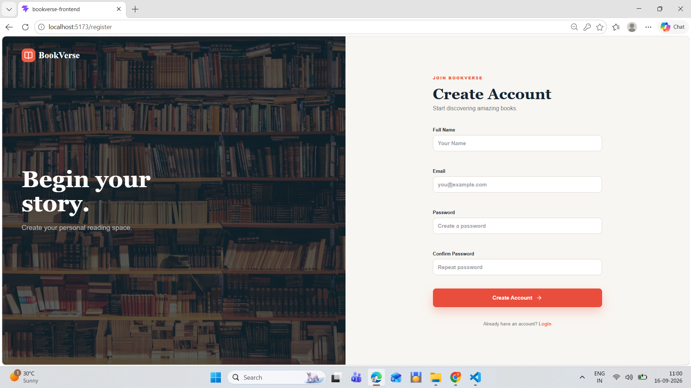

The registration form includes:

- Name
- Email
- Password
- Confirm Password

The application validates the registration information before creating the user.

Registered users are stored in browser `localStorage` for this frontend demonstration.

---

### 🔐 Login

The Login page provides:

- Email field
- Password field
- Login validation
- Navigation after successful login

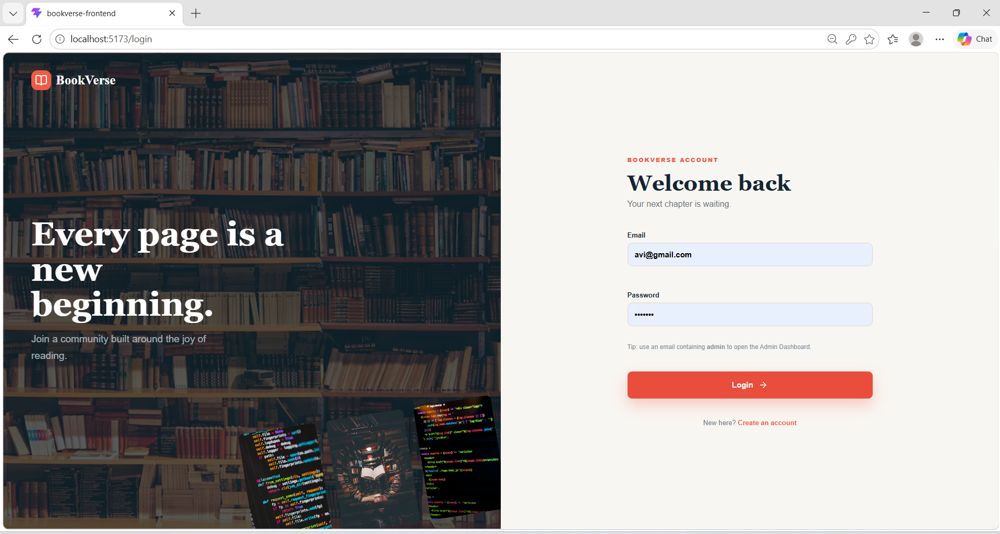

The current user session is maintained on the frontend.

User information is persisted using browser `localStorage`.

---

### 👨‍💼 Admin Access

The current project includes a demonstration role-based login behavior.

An email containing:

```text
admin
```

is treated as an administrator login and opens the Admin Dashboard.

For example:

```text
admin@example.com
```

> ⚠️ **Security Note**
>
> This is only a frontend demonstration mechanism. It is **not** secure production authentication.
>
> A production application should use:
>
> - Backend authentication
> - Password hashing
> - JWT/session authentication
> - Role-based authorization
> - Protected backend APIs

---

### 👤 User Profile

The Profile page displays information related to the currently logged-in user.

The profile area provides information such as:

- Name
- Email
- Account type
- Wishlist information
- Cart information
- Account statistics

---

### 💳 Checkout

The Checkout page completes the customer shopping flow.

The user enters delivery information such as:

- Full Name
- Address
- City
- Pincode

The form uses React state and validation to manage the entered information.

The application also prevents the checkout flow when there is no product available for purchase.

---

### ✅ Payment Success

After completing the frontend checkout flow, the application displays a payment/order success page.

The purpose of this page is to demonstrate the final stage of an e-commerce purchase journey.

> **Important**
>
> The current BookVerse project does not process real payments. There is no live payment gateway integration.
>
> For a production implementation, a secure backend and payment service would be required.

---

### 🌙 Dark Mode

BookVerse supports both:

```text
Light Mode
Dark Mode
```

The theme can be changed from the navigation bar.

The dark-mode state is managed through the application's shared context and the document's CSS class.

---

## 🛠️ Admin Dashboard

BookVerse includes a separate Admin Dashboard.

The Admin area provides a different interface from the customer storefront.

The main admin sections are:

```text
Dashboard
Books
Categories
Users
Orders
Profile
```

The admin interface uses a dedicated sidebar/navigation structure. This makes it visually clear that the administrator has entered the back-office area.

---

### 📊 Admin Dashboard

The Dashboard provides an overview of the bookstore.

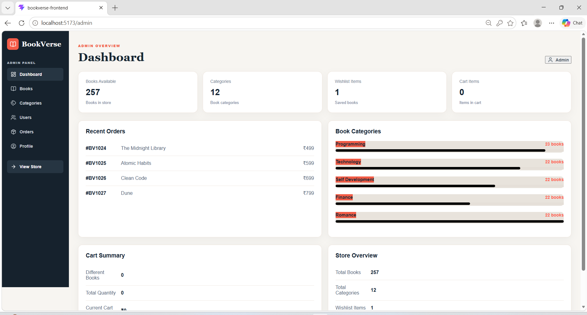

It displays store-related information such as:

- Total books
- Categories
- Wishlist information
- Cart information
- Recent order information
- Category distribution
- Store summary

The dashboard provides quick navigation to the major management modules.

---

### 📖 Manage Books

The Manage Books section demonstrates CRUD operations.

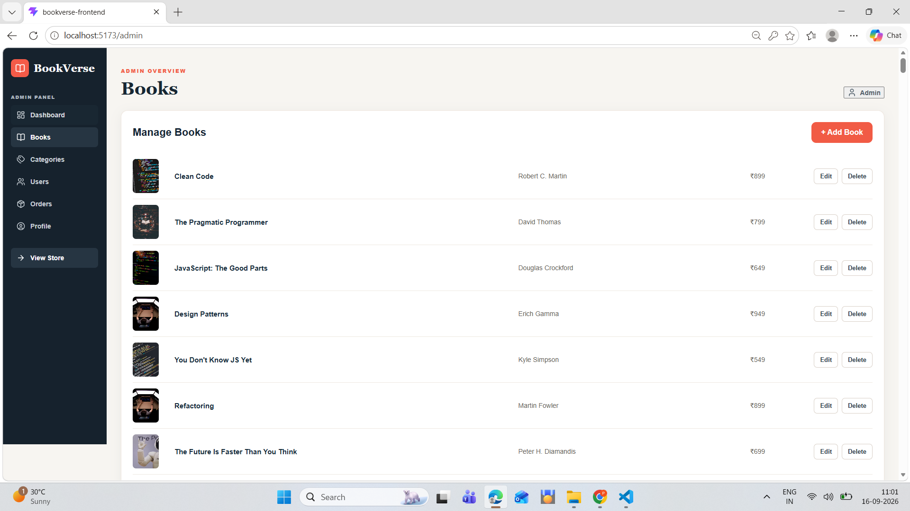

CRUD means:

```text
Create
Read
Update
Delete
```

Administrators can:

- Add books
- Edit books
- Delete books
- View the available books

Book information includes fields such as:

- Title
- Author
- Price

The interface uses a consistent management layout with `Add`, `Edit`, and `Delete` actions.

---

### 🏷️ Manage Categories

The Categories section allows administrators to manage bookstore categories.

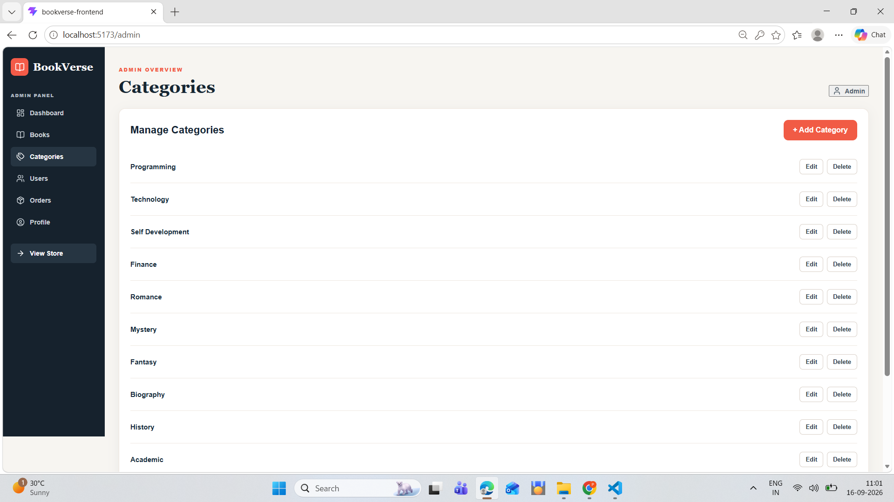

Administrators can:

- Add categories
- Edit categories
- Delete categories
- View categories

The interface follows the same management pattern used in the Books section.

---

### 👥 Manage Users

The Users section provides an administrative interface for registered users.


Administrators can:

- View users
- Add users
- Edit users
- Delete users

The current implementation is frontend-based.

---

### 📦 Manage Orders

The Orders section provides an interface for managing order records.

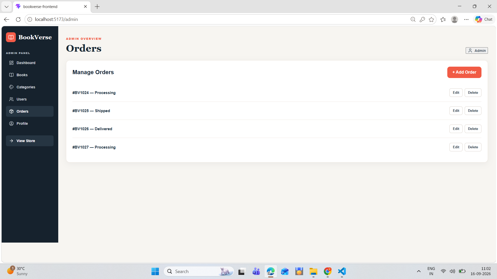

Order statuses include examples such as:

```text
Processing
Shipped
Delivered
```

Administrators can:

- View orders
- Edit order information
- Delete order records
- Track order status

The current implementation is a frontend demonstration and is not connected to a backend order database.

---

### 👨‍💼 Admin Profile

The Admin Profile page provides information about the administrator and the bookstore.

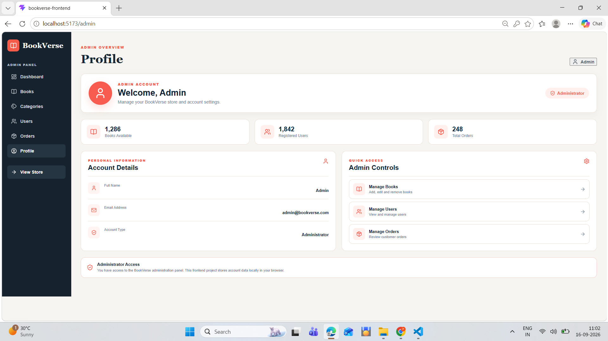

It includes:

- Administrator information
- Account type
- Store statistics
- Quick-access navigation
- Links to management sections

The page reinforces the separation between the normal customer experience and the administrator experience.

---

## 🧠 React Concepts Used

This project demonstrates several important React concepts.

### Components

The UI is divided into reusable components. Examples include:

```text
Navbar
Footer
BookCard
Dashboard
Admin
AdminContent
AdminProfile
```

### Props

The reusable `BookCard` component receives book information through props.

```jsx
<BookCard book={book} />
```

This allows the same component to display different books.

### useState

React `useState` is used for dynamic application values such as:

- Search input
- Filters
- Form fields
- Cart
- Wishlist
- Login information
- Admin data
- Dark mode

### useEffect

`useEffect` is used for operations such as:

- Synchronizing state with `localStorage`
- Updating theme-related document classes

### useMemo

`useMemo` is used for derived catalog data such as:

- Filtered books
- Search results
- Sorted books

This avoids unnecessary recalculation when unrelated state changes.

---

## 🌐 Context API

BookVerse uses React Context API for shared application state.

The main context file is:

```text
src/context/AppContext.jsx
```

The context manages information such as:

```text
User
Cart
Wishlist
Buy Now Item
Dark Mode
```

This allows multiple components to access common application state without passing props through every component.

---

## 🪝 Custom Hook

The project uses a custom hook:

```text
useApp()
```

This provides convenient access to the application's shared context.

```jsx
const {
  cart,
  wishlist,
  addToCart
} = useApp();
```

---

## 🧭 React Router

BookVerse uses:

```text
react-router-dom
```

for client-side navigation.

This allows the application to behave like a Single Page Application while supporting multiple routes.

---

## 🗺️ Application Routes

| Route | Purpose |
|---|---|
| `/` | Home |
| `/books` | Book catalog |
| `/categories` | Categories |
| `/new-releases` | New Releases |
| `/best-sellers` | Best Sellers |
| `/login` | Login |
| `/register` | Registration |
| `/profile` | User Profile |
| `/wishlist` | Wishlist |
| `/cart` | Shopping Cart |
| `/checkout` | Checkout |
| `/payment-success` | Payment Success |
| `/admin` | Admin Dashboard |
| `/admin/books` | Manage Books |
| `/admin/categories` | Manage Categories |
| `/admin/users` | Manage Users |
| `/admin/orders` | Manage Orders |

---

## 💾 LocalStorage

BookVerse uses browser `localStorage` to persist frontend information.

The application uses storage for data such as:

```text
Logged-in user
Registered users
Cart
Wishlist
Buy Now item
Theme preference
```

This means selected frontend information can remain available after refreshing the browser.

> **Important**
>
> `localStorage` is suitable for this frontend demonstration, but it should not be used as a secure storage mechanism for sensitive production authentication data.

---

## 📁 Project Structure

```text
BookVerse/
│
├── src/
│   │
│   ├── admin/
│   │   ├── Admin.jsx
│   │   ├── AdminContent.jsx
│   │   ├── AdminProfile.jsx
│   │   └── Dashboard.jsx
│   │
│   ├── assets/
│   │   ├── hero.png
│   │   ├── react.svg
│   │   ├── vite.svg
│   │   └── other project images
│   │
│   ├── components/
│   │   ├── BookCard.jsx
│   │   ├── Footer.jsx
│   │   └── Navbar.jsx
│   │
│   ├── context/
│   │   └── AppContext.jsx
│   │
│   ├── data/
│   │   └── booksData.js
│   │
│   ├── pages/
│   │   ├── BestSellers.jsx
│   │   ├── Books.jsx
│   │   ├── Cart.jsx
│   │   ├── Categories.jsx
│   │   ├── Checkout.jsx
│   │   ├── Home.jsx
│   │   ├── Login.jsx
│   │   ├── NewReleases.jsx
│   │   ├── PaymentSuccess.jsx
│   │   ├── Profile.jsx
│   │   ├── Register.jsx
│   │   └── Wishlist.jsx
│   │
│   ├── App.css
│   ├── App.jsx
│   ├── index.css
│   └── main.jsx
│
├── public/
│
├── screenshots/
│
├── package.json
│
└── README.md
```

---

## 📄 Important Files

**`src/main.jsx`**

The main entry point of the React application. It is responsible for starting the React application and connecting the application to routing and shared context.

**`src/App.jsx`**

The main application component. It contains the application's route configuration and connects the different pages.

**`src/context/AppContext.jsx`**

The main shared-state layer. It manages:

- User
- Cart
- Wishlist
- Buy Now
- Theme
- Cart calculations
- LocalStorage synchronization

**`src/components/BookCard.jsx`**

Reusable component for displaying books. It handles UI elements such as:

- Book cover
- Title
- Author
- Rating
- Price
- Discount
- Wishlist button
- Add to Cart
- Buy Now

**`src/components/Navbar.jsx`**

The shared navigation component. It provides navigation to areas such as:

- Home
- Books
- Categories
- Wishlist
- Cart
- Profile
- Login
- Admin

It also displays cart/wishlist information and the theme toggle.

**`src/components/Footer.jsx`**

Reusable footer component used throughout the customer-facing pages.

**`src/data/booksData.js`**

Contains the bookstore's book catalog and category information.

The current catalog contains:

```text
257 Books
12 Categories
```

---

## 🎨 UI and Design

BookVerse uses custom CSS to create its interface.

The main styling files are:

```text
src/index.css
src/App.css
```

The UI includes:

- Responsive layouts
- Book cards
- Navigation
- Forms
- Cart interface
- Wishlist interface
- Admin sidebar
- Admin management screens
- Dark mode
- Buttons
- Empty states
- Interactive controls

The project also uses `lucide-react` for interface icons.

---

## 🧰 Technology Stack

| Technology | Purpose |
|---|---|
| React 19 | Frontend UI |
| Vite | Development and build tooling |
| JavaScript | Application logic |
| JSX | React UI structure |
| React Router | Client-side routing |
| Context API | Shared state management |
| CSS | Styling and responsive design |
| localStorage | Client-side persistence |
| Lucide React | UI icons |

---

## 🔄 Application Flow

The main customer flow is:

```text
Home
  ↓
Books
  ↓
Search / Filter / Sort
  ↓
View Book
  ↓
Wishlist / Add to Cart
  ↓
Cart
  ↓
Checkout
  ↓
Payment Success
```

The account flow is:

```text
Register
  ↓
Login
  ↓
Profile
```

The administrator flow is:

```text
Admin Login
  ↓
Admin Dashboard
  ↓
Manage Books
  ↓
Manage Categories
  ↓
Manage Users
  ↓
Manage Orders
  ↓
Admin Profile
```

---

## 🏗️ High-Level Architecture

```text
                         BOOKVERSE
                             │
              ┌──────────────┴──────────────┐
              │                             │
       CUSTOMER APPLICATION            ADMIN APPLICATION
              │                             │
      ┌───────┼────────┐            ┌───────┼────────┐
      │       │        │            │       │        │
    Books   Wishlist   Cart      Books   Users    Orders
      │       │        │            │       │        │
      └───────┴────────┘            └───────┴────────┘
              │
           Checkout
              │
       Payment Success
```

Shared application state:

```text
                 AppContext
                     │
       ┌─────────────┼─────────────┐
       │             │             │
      User         Cart        Wishlist
       │             │             │
       └─────────────┼─────────────┘
                     │
                  Theme
                     │
                localStorage
```

---

## 🚀 Installation and Setup

### 1. Clone the Repository

```bash
git clone <your-repository-url>
```

Move into the project directory:

```bash
cd BookVerse
```

### 2. Install Dependencies

```bash
npm install
```

### 3. Start the Development Server

```bash
npm run dev
```

Vite will display the local development URL in the terminal. Usually it will be similar to:

```text
http://localhost:5173
```

---

## 🏭 Production Build

To create a production build:

```bash
npm run build
```

To preview the production build locally:

```bash
npm run preview
```

---

## 🧪 Testing the Application

A simple manual testing flow is:

### Customer

```text
1. Open Home
2. Go to Books
3. Search for a book
4. Apply a category filter
5. Change sorting
6. Add a book to Wishlist
7. Add a book to Cart
8. Change quantity
9. Open Checkout
10. Enter customer details
11. Complete the demo checkout
12. Verify Payment Success
```

### Account

```text
1. Open Register
2. Create a user
3. Login
4. Open Profile
5. Verify user information
```

### Admin

```text
1. Login using an admin email
2. Open Admin Dashboard
3. View dashboard statistics
4. Open Books
5. Add/Edit/Delete a book
6. Open Categories
7. Add/Edit/Delete a category
8. Open Users
9. Open Orders
10. Open Admin Profile
```

---

## ⚠️ Current Limitations

BookVerse is currently a frontend-focused project. It does not currently have a production backend or database.

Therefore:

**Authentication** — The project does not currently provide secure server-side authentication.

**Database** — Book information and demo management data are not connected to a backend database.

**Payments** — There is no real payment gateway.

**Orders** — Orders are demonstrated on the frontend and are not persisted in a production database.

**Security** — The application should not be considered production-secure because authentication and persistence are handled on the client side.

---

## 🚀 Future Enhancements

The project can be converted into a full-stack e-commerce application by adding a backend.

### Backend

Possible backend functionality:

- REST APIs
- Database integration
- Product APIs
- User APIs
- Order APIs
- Category APIs
- Inventory APIs

### Database

A production database could store:

```text
Users
Books
Categories
Wishlist
Cart
Orders
Order Items
Addresses
Payments
```

### Authentication

A secure authentication system could include:

- Password hashing
- JWT authentication
- Role-based authorization
- Protected routes
- Secure sessions
- Backend validation

### Payment Integration

A real payment gateway could be added for:

- Online payments
- Payment verification
- Transaction records
- Order confirmation

### Order Management

Future versions could include:

- Order history
- Order tracking
- Order cancellation
- Order status updates
- Invoice generation

### Inventory Management

The admin dashboard could be extended with:

- Stock quantity
- Low-stock alerts
- Inventory updates
- Out-of-stock handling

---

## 📈 Learning Outcomes

This project demonstrates practical understanding of:

- React
- React components
- Functional components
- Props
- State management
- `useState`
- `useEffect`
- `useMemo`
- Context API
- Custom hooks
- React Router
- URL query parameters
- Form handling
- Form validation
- Event handling
- Conditional rendering
- LocalStorage
- CRUD-style interfaces
- Responsive CSS
- Dark mode
- Reusable components
- E-commerce UI development
- Admin dashboard development

---

## 🎯 Project Highlights

```text
257 Books
12 Categories
Customer Storefront
Wishlist
Shopping Cart
Buy Now
Checkout
User Registration
Login
User Profile
Admin Dashboard
Book Management
Category Management
User Management
Order Management
Dark Mode
Responsive UI
React Context API
React Router
localStorage
```

---

## 📸 Application Screens

The project includes dedicated interfaces for Home, Books, Categories, New Releases, Best Sellers, Login, Registration, Wishlist, Cart, Checkout, Payment Success, User Profile, and the full Admin area.

### Customer Storefront

| Screen | Preview |
|---|---|
| Home |  |
| Books |  |
| Categories |  |
| New Releases |  |
| Best Sellers |  |
| Login |  |
| Registration |  |

### Admin Panel

| Screen | Preview |
|---|---|
| Dashboard |  |
| Manage Books |  |
| Manage Categories |  |
| Manage Users |  |
| Manage Orders |  |
| Admin Profile |  |

---

## 🎓 Project Purpose

BookVerse was developed as a React frontend project to demonstrate how a modern e-commerce application can be structured using reusable components, shared state, client-side routing, forms, filtering, and responsive styling.

The project focuses on both:

```text
User Experience
```

and

```text
React Application Architecture
```

while also demonstrating how a separate administrator experience can be built within the same application.

---

## 👩‍💻 Author

**Mekala Pavithra**

**Project:** BookVerse — Online Bookstore

**Technologies:**

```text
React
Vite
JavaScript
React Router
Context API
CSS
localStorage
Lucide React
```

---

## ⭐ Conclusion

BookVerse demonstrates a complete frontend bookstore journey:

```text
DISCOVER
   ↓
SEARCH
   ↓
FILTER
   ↓
WISHLIST / CART
   ↓
CHECKOUT
   ↓
ORDER CONFIRMATION
```

Alongside the customer experience, the application provides an administrative workflow:

```text
ADMIN DASHBOARD
      ↓
BOOKS
      ↓
CATEGORIES
      ↓
USERS
      ↓
ORDERS
      ↓
ADMIN PROFILE
```

The project provides a strong foundation for extending the current frontend application into a complete full-stack e-commerce platform with a secure backend, database, authentication, payment processing, and persistent order management.
